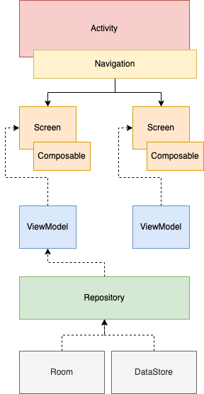

# Android2022
2022年のAndroidアプリ構成を模索するリポジトリ

# Architecture

- 単一のActivityをエントリポイントとして持つ
- ViewはComposableで作成する、ひとつの画面のルートとしてScreenと名付けたComposableを用意する
- 1つのScreenごとに1つのViewModelを持つようにして、表示に必要なUI状態の受け取り、イベントの送信を行う
- ViewModelは外部データとやり取りするためのRepositoryなどの詳細なモデルロジックの窓口となる

## 自問自答集

Q.DIはHiltにした方がいい？

A.個人的にKOIN派だったんですけれど、Composeとがっつり連携してくれるので、Hiltかなり便利。

Q.まだComposableでは従来のViewでできたことを100％実現できなかったり、既存のView資産が存在する可能性があるのでは？

A.ちょこちょこありそう。

`Navigation`のDestinationが`Activity`/`Fragment`だけでなく、`Composable`にも対応しているので、`Navigation`まで対応しておけば、あとから追加部分は`Composable`で作成する、などの対応がやりやすそう。

Q.テーマカラーをコードで指定するべきかxmlで指定するべか？

A.従来のViewが混在する場合は、xmlに定義して[MDC-Android Compose Theme Adapter](https://material-components.github.io/material-components-android-compose-theme-adapter/)を使うという方法がよさそう。

ただしコードに定義したときとは異なり、Android Studioのエディタ上で色が確認できないのがすこし難点。